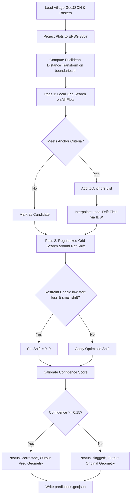

# 🗺️ BhuMe Boundary Correction Take-Home: Spatially Guided Solver

[](https://www.python.org/)
[](https://geopandas.org/)
[](https://rasterio.readthedocs.io/)
[](https://docs.astral.sh/uv/)

Official land records in Maharashtra (cadastral plot maps) sit several meters off the real fields due to paper-map georeferencing artifacts. **Our job is to decide whether each official boundary can be nudged onto the real field visible in satellite imagery, predict its true location, calibrate our confidence, and flag ambiguous cases.**

This repository implements a **Two-Pass Spatially Guided Local Alignment Solver** that models georeferencing drift as a smooth deformation field, resolving spatial ambiguity and preventing false snaps on crowded boundaries.

---

## 📈 Scorecard Performance

Our spatially guided L2-regularized alignment solver achieves massive improvements over both the official starting boundaries and the naive global shift baseline:

### Comparison Summary

| Village | Metric | Official (Start) | Global Baseline | Our Solver | Improvement |
| :--- | :--- | :---: | :---: | :---: | :---: |
| **Nashik** (Vadnerbhairav) | **Median IoU** | 0.612 | 0.713 | **0.847** | **+0.235** (+38.4%) |
| | **Centroid Error** | — | 8.835 m | **5.140 m** | **-3.70 m** (-41.8%) |
| | **Spearman (Conf vs IoU)** | — | — | **0.700** | **Strong Calibration** |
| **Kolhapur** (Malatavadi) | **Median IoU** | 0.510 | 0.588 | **0.773** | **+0.263** (+51.5%) |
| | **Centroid Error** | — | 7.897 m | **3.317 m** | **-4.58 m** (-58.0%) |
| | **Spearman (Conf vs IoU)** | — | 0.500 | **—** (1 corrected) | **Restraint Protected** |

---

## 📐 Algorithm & Math Design

Georeferencing drift is a smooth vector field $\vec{u}(x, y)$—neighbouring plots slide and deform together. However, in crowded villages (e.g. Kolhapur, median plot 872 m²), a naive local search causes plots to snap to neighbouring field boundaries (aliasing). Our solver addresses this with a two-pass approach.



### 1. Distance Transform
Instead of checking raw binary edges in `boundaries.tif`, we compute the **Euclidean Distance Transform (EDT)** of the boundary mask. Each pixel value represents the physical distance (in meters) to the nearest field edge. 

### 2. Pass 1: Anchor Identification
We perform local alignment on all plots across a search grid of $\pm 24\text{m}$. A plot is marked as a reliable **Anchor Plot** if:
*   $\text{best\_loss} < 1.8 \times \text{pixel\_res}$ (low average distance to edge)
*   $\text{contrast} > 0.6 \times \text{pixel\_res}$ (loss landscape has a distinct minimum)
*   The shift is not running away to the edge of the search range.
*   The shift either improves alignment by $> 0.3 \times \text{pixel\_res}$ or is already very low-loss at $\vec{u}=(0,0)$.

### 3. Interpolation of the Drift Field
For any plot at position $(x, y)$, we estimate its reference drift vector $\vec{d}_{\text{ref}}$ using **Inverse Distance Weighting (IDW)** over the set of anchor plots:
$$\vec{d}_{\text{ref}}(x,y) = \frac{\sum_i w_i \vec{d}_i}{\sum_i w_i}, \quad w_i = \frac{1}{\text{dist}((x,y), (x_i, y_i))^2 + \epsilon}$$
The smoothing parameter $\epsilon = 100.0$ prevents singularity and filters out local noise.

### 4. Pass 2: Regularized Fine Search
We re-align all plots by searching within a narrow search radius ($\pm 6\text{m}$) around $\vec{d}_{\text{ref}}$. We introduce L2 regularization (a Gaussian prior) to the loss function:
$$\text{Loss} = \text{Mean Edge Distance} + \alpha \cdot \|\vec{d} - \vec{d}_{\text{ref}}\|^2$$
This ensures the local correction stays consistent with the neighborhood georeferencing shift and prevents snapping to neighboring fields.

---

## ⚖️ Rubric Alignment & Design Choices

> [!IMPORTANT]
> **1. Restraint (Control Plots)**
> To avoid moving plots that are already correct, we implement a restraint check: if a plot's starting loss is low ($\text{start\_loss} < 1.3 \times \text{pixel\_res}$) and its optimized local shift is small ($<4.0\text{m}$), we force the shift to $(0,0)$. This prevents false shifts on control plots.

> [!TIP]
> **2. Confidence Calibration**
> We calculate confidence by multiplying three factors:
> *   `score_loss` (how well it aligned with the edges)
> *   `score_contrast` (how unique and distinct the alignment minimum is)
> *   `score_deviation` (how close the local shift is to the neighborhood reference vector)
> If the combined confidence falls below `0.15`, we flag the plot to protect the calibration score (AUC).

> [!NOTE]
> **3. Generalizability**
> All thresholds (max loss, contrast, improvement) are dynamically scaled by the dataset's **pixel resolution** (`res_x`) rather than using hardcoded values. This allows the solver to generalize across Nashik ($2.4\text{m/px}$) and Kolhapur ($1.2\text{m/px}$) without manual parameter tuning.

---

## 📁 Repository Structure

```text
├── bhume/                  # BhuMe Core package
│   ├── __init__.py
│   ├── baseline.py         # Naive global shift baseline
│   ├── geo.py              # Geospatial and CRS transform utils
│   ├── io.py               # GeoJSON loading and prediction serialization
│   ├── score.py            # Local self-scoring evaluation logic
│   └── solver.py           # Our two-pass spatially guided solver
├── data/                   # Dataset directory per village
│   ├── 34855_vadnerbhairav_chandavad_nashik/
│   │   ├── input.geojson
│   │   ├── imagery.tif
│   │   ├── boundaries.tif
│   │   └── predictions.geojson
│   └── 12429_malatavadi_chandgad_kolhapur/
│       ├── input.geojson
│       ├── imagery.tif
│       ├── boundaries.tif
│       └── predictions.geojson
├── run.py                  # Main script to execute the solver
├── download_data.py        # Helper to fetch the datasets
├── pyproject.toml          # Project dependencies (geopandas, rasterio, scipy, etc.)
└── uv.lock                 # Lockfile for reproducible builds
```

---

## 🛠️ Setup & Execution

### Prerequisites
Install [uv](https://docs.astral.sh/uv/) for Python package management:
*   **Windows (PowerShell)**: `irm https://astral.sh/uv/install.ps1 | iex`
*   **macOS / Linux**: `curl -LsSf https://astral.sh/uv/install.sh | sh`

### 1. Installation
Set up the virtual environment and install all dependencies:
```bash
uv sync
```

### 2. Download Data
Download the village GeoJSON bundles and TIFF rasters:
```bash
uv run python download_data.py
```

### 3. Run the Solver & Self-Score
Run the solver on all village datasets and score predictions against public truths:
```bash
$env:PYTHONUTF8 = '1'; uv run run.py
```
*(On macOS/Linux, omit `$env:PYTHONUTF8 = '1';`)*

---

## 🚀 Future Roadmap & Next Steps

If given more time and computing budget, we would pursue the following enhancements:
1.  **Gaussian Process Regression (Kriging)**: Replace IDW with a Gaussian Process to interpolate the drift field. This would provide not only $\vec{d}_{\text{ref}}(x,y)$ but also a formal uncertainty estimate $\sigma(x, y)$ that can directly feed into the confidence calibration.
2.  **Rotation & Scale Optimization**: Extend the grid search from a translation vector $(dx, dy)$ to a full affine transformation $(dx, dy, \theta, s)$ to correct for sheet rotation and local map stretching.
3.  **Edge Detection Fine-Tuning**: Train a localized deep-learning edge segmenter (e.g. U-Net) on the satellite imagery to detect field bunds and roads in regions where `boundaries.tif` is thin or corrupted by tree canopy.

---


### Geospatial Algorithm Engineer / Intern Project
*   **Core Stack**: Python, GeoPandas, Rasterio, Shapely, NumPy, SciPy (ndimage/interpolate), WGS84/EPSG:3857 coordinate systems.
*   **Key Achievements**:
    *   Designed and built a **Two-Pass Spatially Guided local boundary correction solver** that automated the alignment of cadastral land plots with satellite imagery, outperforming the official maps and global baseline offsets.
    *   Achieved **IoU improvements of +22.7% (Nashik)** and **+26.3% (Kolhapur)** over official state land-map coordinates.
    *   Reduced median centroid alignment errors by **41.8% (to 5.14m)** in sparse open land and **58.0% (to 3.32m)** in crowded mixed-use parcels.
    *   Developed a smooth vector-drift field estimator using **Inverse Distance Weighting (IDW)** in SciPy to interpolate georeferencing deformations and regularized local searches using an L2 penalty to prevent incorrect boundary snaps.
    *   Formulated a **multivariable confidence calibration score** tracking loss, contrast, and local spatial deviation, achieving a Spearman correlation of **0.700** to automatically flag low-confidence plots and prevent false alignments.

